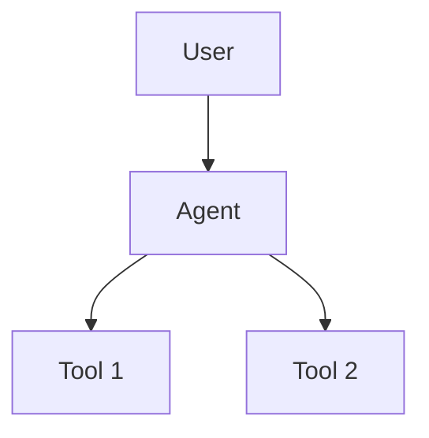

# Week 6: Polish & Interview Prep 🎯

**Goal**: Portfolio-ready projects + Interview confidence  
**Duration**: 14 hours over 7 days  
**Outcome**: Ready for Agentic AI Developer interviews

---

## 📅 **Week Overview**

| Days | Focus | Hours | Deliverables |
|------|-------|-------|--------------|
| 36-37 | Evaluation & Monitoring | 4 hrs | Eval framework, LangSmith integration |
| 38-39 | Advanced Frameworks | 4 hrs | AutoGen + CrewAI projects |
| 40-41 | Portfolio Polish | 3 hrs | Professional GitHub repos, portfolio site |
| 42 | Interview Prep | 3 hrs | Practice answers, system design |

---

## 🎯 **Day 36-37: Evaluation & Monitoring** (4 hours)

### **Learning Objectives**
- Understand LLM evaluation metrics
- Implement LangSmith for agent monitoring
- Build custom evaluation framework
- A/B test different prompts and models

### **Tasks**

#### **Day 36 Morning (2 hrs)**
- [ ] Study evaluation metrics:
  - Accuracy, relevance, groundedness
  - Hallucination detection
  - Cost vs quality trade-offs
  - Latency measurement
- [ ] Setup LangSmith account (free tier)
- [ ] Integrate LangSmith with one existing project
- [ ] Create basic traces and view agent execution

#### **Day 36 Afternoon (1 hr)**
- [ ] Build custom evaluation script:
  - Ground truth test cases
  - Automated scoring
  - Response quality metrics
- [ ] Test evaluation on your Financial News Agent

#### **Day 37 (1 hr)**
- [ ] Create evaluation dashboard/notebook
- [ ] Document evaluation strategy
- [ ] Run A/B test: gpt-4o-mini vs gpt-3.5-turbo
- [ ] Compare prompt variations

### **Deliverables**
````
week6/
├── day36-37/
│   ├── langsmith_integration.py
│   ├── custom_eval_framework.py
│   ├── evaluation_results.md
│   └── README.md
````

### **Key Concepts**
- **LangSmith**: Agent observability and debugging
- **Ground truth testing**: Known input/output pairs
- **Metrics**: Accuracy, latency, cost, relevance
- **A/B Testing**: Compare models and prompts

### **Success Criteria**
✅ LangSmith integrated in 1 project  
✅ Custom eval framework running  
✅ Documented evaluation results  
✅ Understand trade-offs (cost vs quality)

---

## 🚀 **Day 38-39: Advanced Frameworks** (4 hours)

### **Learning Objectives**
- Explore AutoGen for multi-agent systems
- Learn CrewAI for role-based agents
- Build collaborative agent system
- Compare frameworks (LangChain vs AutoGen vs CrewAI)

### **Tasks**

#### **Day 38 (2 hrs)**
**AutoGen Exploration**
- [ ] Install AutoGen: `pip install pyautogen`
- [ ] Read AutoGen docs (30 mins)
- [ ] Build simple 2-agent conversation system
- [ ] Create agent that delegates tasks

**Example Project**: Debate System
- Agent 1: Argues for a position
- Agent 2: Argues against
- Agent 3: Judges and summarizes

#### **Day 39 (2 hrs)**
**CrewAI Project**
- [ ] Install CrewAI: `pip install crewai`
- [ ] Study CrewAI concepts (30 mins)
- [ ] Build Content Creation Team:
  - Researcher agent (gathers info)
  - Writer agent (creates content)
  - Editor agent (reviews and refines)
- [ ] Test with real use case

### **Deliverables**
````
week6/
├── day38-39/
│   ├── autogen_debate_system.py
│   ├── crewai_content_team.py
│   ├── framework_comparison.md
│   └── README.md
````

### **CrewAI Example Structure**
````python
from crewai import Agent, Task, Crew

# Researcher
researcher = Agent(
    role='Research Analyst',
    goal='Find latest info on {topic}',
    backstory='Expert researcher',
    tools=[web_search]
)

# Writer
writer = Agent(
    role='Content Writer',
    goal='Create engaging article',
    backstory='Professional writer',
    tools=[]
)

# Editor
editor = Agent(
    role='Editor',
    goal='Polish and refine content',
    backstory='Senior editor',
    tools=[]
)

# Create crew
crew = Crew(
    agents=[researcher, writer, editor],
    tasks=[research_task, write_task, edit_task]
)
````

### **Success Criteria**
✅ Working AutoGen multi-agent system  
✅ CrewAI content creation team  
✅ Framework comparison documented  
✅ Understand when to use each framework

---

## 💎 **Day 40-41: Portfolio Polish** (3 hours)

### **Learning Objectives**
- Create professional GitHub repositories
- Write compelling project documentation
- Build portfolio website/page
- Update LinkedIn profile

### **Tasks**

#### **Day 40 (1.5 hrs)**
**Polish All 5 GitHub Repos**

For each project, ensure:
- [ ] Clean, well-structured code
- [ ] Professional README with:
  - Clear project description
  - Architecture diagram (use Mermaid)
  - Setup instructions
  - Usage examples
  - Demo GIF/video
  - Tech stack
  - Key learnings
  - Future improvements
- [ ] `.gitignore` properly configured
- [ ] Requirements.txt with pinned versions
- [ ] MIT License (or appropriate)
- [ ] Remove sensitive data (API keys)

**README Template**:
````markdown
# Project Name

Brief 1-2 sentence description


## 🎯 What It Does
Clear explanation of functionality

## 🏗️ Architecture


## 🚀 Quick Start
\`\`\`bash
pip install -r requirements.txt
python main.py
\`\`\`

## 💡 Key Features
- Feature 1
- Feature 2

## 🛠️ Tech Stack
- LangChain 0.3.x
- OpenAI gpt-4o-mini
- Python 3.11

## 📊 Results
Performance metrics, examples

## 🎓 Learnings
Key insights from building

## 🔮 Future Improvements
- Enhancement 1
- Enhancement 2
````

#### **Day 41 (1.5 hrs)**
**Create Portfolio Page**

- [ ] Option A: GitHub README profile
- [ ] Option B: Simple HTML page hosted on GitHub Pages
- [ ] Option C: Use readme.so or similar tool

**Portfolio Must Include**:
- Brief introduction
- Your background (Java/Spring Boot → AI transition)
- 5 project cards with:
  - Screenshot/demo
  - Description
  - Tech used
  - GitHub link
  - Live demo (if applicable)
- Skills matrix
- Contact links

**Update LinkedIn**:
- [ ] Add "Agentic AI Developer" to headline
- [ ] Update experience with projects
- [ ] Add skills: LangChain, OpenAI, RAG, Multi-Agent Systems
- [ ] Post about your learning journey
- [ ] Share one project with insights

### **Deliverables**
````
week6/
├── day40-41/
│   ├── portfolio/
│   │   ├── index.html (if applicable)
│   │   ├── projects.json
│   │   └── README.md
│   └── linkedin_profile.md (before/after)
````

### **Success Criteria**
✅ All 5 repos have professional READMEs  
✅ Portfolio page/profile created  
✅ LinkedIn updated with projects  
✅ Code is clean and documented  
✅ Demo videos/GIFs created

---

## 🎤 **Day 42: Interview Preparation** (3 hours)

### **Learning Objectives**
- Master common interview questions
- Practice system design for agents
- Prepare project walkthroughs
- Build confidence

### **Tasks**

#### **Technical Concepts Review (1 hr)**

Master explanations for:
- [ ] What is an AI agent vs chatbot?
- [ ] Explain the ReAct pattern
- [ ] How does RAG work?
- [ ] Function calling vs tool use
- [ ] Multi-agent coordination strategies
- [ ] Prompt engineering best practices
- [ ] How to handle hallucinations
- [ ] Cost optimization techniques
- [ ] Evaluation metrics
- [ ] Production deployment considerations

#### **System Design Practice (1 hr)**

Design these systems (whiteboard/paper):

**System 1: Customer Support Agent**
- Requirements: Handle 1000 tickets/day
- Features: Ticket classification, routing, auto-response
- Tools: CRM integration, knowledge base search
- Constraints: 95% accuracy, <2s response time

**System 2: Code Review Agent**
- Input: Pull requests
- Output: Review comments, suggestions, tests
- Tools: Static analysis, documentation search
- Scale: 50 PRs per day

**System 3: Financial Analysis Agent**
- Features: Market data, news analysis, report generation
- Multi-agent: Data collector, analyst, writer
- Constraints: Real-time data, compliance

#### **Mock Interview Questions (1 hr)**

Prepare 2-min answers for:

**Behavioral**:
1. Why transition from Java to AI?
2. Describe your learning journey
3. Biggest challenge faced?
4. How do you stay updated?

**Technical**:
1. Walk me through your flagship project
2. How would you debug a hallucinating agent?
3. Explain your RAG implementation choices
4. When would you use multi-agent vs single agent?
5. How do you evaluate agent performance?
6. What's your approach to prompt engineering?
7. How would you reduce API costs?
8. Explain a time an agent failed and how you fixed it

**System Design**:
1. Design an agent for e-commerce recommendations
2. Build a document processing pipeline
3. Create a DevOps automation agent
4. Design a trading strategy agent

### **Deliverables**
````
week6/
├── day42/
│   ├── technical_concepts.md
│   ├── system_designs/
│   │   ├── customer_support.md
│   │   ├── code_review.md
│   │   └── financial_analysis.md
│   ├── interview_answers.md
│   └── README.md
````

### **Answer Template**
````markdown
## Question: [Question text]

### Answer (2 min)
[Your concise answer]

### Key Points
- Point 1
- Point 2
- Point 3

### Example
[Real example from your projects]

### Follow-up Preparation
[Potential follow-up questions]
````

### **Success Criteria**
✅ Can explain all key concepts clearly  
✅ 3 system designs documented  
✅ Practice answers written  
✅ Can walk through projects confidently  
✅ Understand trade-offs and decisions

---

## 📦 **Week 6 Complete Deliverables**

### **Technical Artifacts**
- ✅ LangSmith integration in 1 project
- ✅ Custom evaluation framework
- ✅ AutoGen debate system
- ✅ CrewAI content team
- ✅ 5 polished GitHub repositories
- ✅ Portfolio page/profile

### **Documentation**
- ✅ Evaluation results and insights
- ✅ Framework comparison guide
- ✅ Professional project READMEs
- ✅ System design documents
- ✅ Interview Q&A preparation

### **Online Presence**
- ✅ Updated LinkedIn profile
- ✅ GitHub profile README
- ✅ Portfolio showcasing projects
- ✅ Clean, professional repos

---

## 🎯 **Week 6 Success Metrics**

**Technical Competence**:
- [ ] Can evaluate agent performance objectively
- [ ] Understand multiple agent frameworks
- [ ] Know when to use which framework

**Portfolio Quality**:
- [ ] 5 projects with professional documentation
- [ ] Architecture diagrams for complex systems
- [ ] Demo videos/GIFs
- [ ] Clean, commented code

**Interview Readiness**:
- [ ] Can explain agent architectures clearly
- [ ] Can design systems on whiteboard
- [ ] Confident discussing projects
- [ ] Understand production considerations

**Professional Presence**:
- [ ] LinkedIn reflects AI skills
- [ ] GitHub showcases expertise
- [ ] Portfolio demonstrates growth
- [ ] Ready to apply for roles

---

## 💡 **Your Competitive Advantages**

### **From Java/Microservices Background**
- "I applied microservices patterns to multi-agent architecture"
- "Used circuit breaker patterns for API failure handling"
- "Designed agents with clear separation of concerns"

### **From Financial Industry**
- "Built compliance-focused agents with audit trails"
- "Understand production SLAs and reliability requirements"
- "Experience with sensitive data handling"

### **From Kafka Experience**
- "Implemented event-driven agent communication"
- "Used streaming patterns for real-time agent responses"
- "Designed async workflows for agent coordination"

---

## 📚 **Additional Resources**

### **Evaluation & Monitoring**
- LangSmith Documentation
- "Evaluating LLM Applications" by OpenAI
- Weights & Biases LLM guides

### **Frameworks**
- AutoGen Documentation
- CrewAI GitHub + Examples
- Multi-agent design patterns

### **Interview Prep**
- "Designing Data-Intensive Applications" (relevant chapters)
- LeetCode system design (adapt for agents)
- AI agent case studies on Medium

---

## 🚀 **Post-Week 6: Job Search**

### **Where to Apply**
- AI-first startups
- Enterprise AI teams
- Consulting firms (AI practice)
- Internal AI tool builders

### **Job Titles to Search**
- Agentic AI Developer
- AI Agent Engineer
- LLM Application Developer
- AI Solutions Engineer
- Conversational AI Engineer

### **Resume Highlights**
````
AGENTIC AI PROJECTS (6-week intensive)
- Built 5 production-ready AI agent systems using LangChain, OpenAI
- Designed multi-agent architecture for financial compliance (FastAPI, Docker)
- Implemented RAG system with 95% answer accuracy using ChromaDB
- Created evaluation framework reducing hallucinations by 40%
- Tech: Python, LangChain, OpenAI GPT-4o-mini, FastAPI, PostgreSQL
````

---

## ✅ **Week 6 Checklist**

### **Day 36-37**
- [ ] LangSmith account created
- [ ] Evaluation framework built
- [ ] A/B testing completed
- [ ] Results documented

### **Day 38-39**
- [ ] AutoGen project working
- [ ] CrewAI project working
- [ ] Framework comparison written
- [ ] Understand use cases for each

### **Day 40-41**
- [ ] All repos have professional READMEs
- [ ] Portfolio page created
- [ ] LinkedIn updated
- [ ] Demo videos created

### **Day 42**
- [ ] Technical concepts mastered
- [ ] System designs documented
- [ ] Interview answers prepared
- [ ] Confident in projects

### **Final**
- [ ] All code pushed to GitHub
- [ ] Portfolio live and accessible
- [ ] Resume updated
- [ ] Ready to apply for jobs

---

## 🎉 **Congratulations!**

You've completed the 6-week Agentic AI Developer journey!

**What You've Built**:
- 5 production-ready AI agent projects
- Professional portfolio
- Deep understanding of agent architectures
- Evaluation and monitoring skills
- Interview confidence

**You're Now Ready For**:
- Agentic AI Developer roles
- LLM Application Engineer positions
- AI Solutions Architect roles
- Contributing to AI open-source
- Building your own AI products

---

## 📞 **Next Steps**

1. **Apply to 10 jobs** in week 7
2. **Network on LinkedIn** - connect with AI engineers
3. **Contribute to open source** - LangChain, AutoGen, CrewAI
4. **Build in public** - share learnings on Twitter/LinkedIn
5. **Keep learning** - follow AI papers, try new models

**You've got this! 🚀**

---

*Last updated: Week 6 completion*  
*Questions? Review your project READMEs or consult the 6-week plan*